 

 

&nbsp;

&nbsp;

&nbsp;

### AI Engineer building production agentic systems inside a Tier-1 European bank.
~3 years shipping end-to-end · Bengaluru · open to senior AI Engineer roles

 

## &nbsp; Shipped in production

<table>
<tr><td width="100%">

### &#9670;&nbsp; Customer-Facing Agentic Chatbot
`Enterprise Banking`&nbsp; · &nbsp;`in active development`&nbsp; · &nbsp;**targeting 150,000+ monthly users at GA**

Leading end-to-end development on **AWS Bedrock AgentCore**. Built the RAG pipeline, a custom session-management proxy pattern, a per-invocation config override system, S3-backed session persistence, and an Arize Phoenix / OpenTelemetry observability layer from scratch. Ran a full bug audit of the agent-framework ecosystem — surfaced **16 confirmed framework issues**, including an open contribution to the Strands Agents SDK ([#948](https://github.com/strands-agents/sdk-python/issues/948)).

**Stack**&nbsp;&nbsp;Bedrock AgentCore · Strands Agents SDK · OpenSearch Serverless · Bedrock Guardrails · Terraform

</td></tr>
<tr><td>

### &#9670;&nbsp; Multilingual RAG Knowledge Assistant
`Enterprise Banking`&nbsp; · &nbsp;`live`&nbsp; · &nbsp;**5,000+ advisors across 3 markets**

Replaced fragmented internal search across multiple European markets with a single accurate knowledge layer. Built hybrid **kNN + BM25** retrieval, a multilingual embedding strategy that handles cross-lingual queries without per-language models, and sub-second p95 latency — end to end, including all infra.

**Stack**&nbsp;&nbsp;AWS Bedrock · Elasticsearch (hybrid kNN+BM25) · Python · FastAPI · Terraform

</td></tr>
<tr><td>

### &#9670;&nbsp; Multi-Agent Compliance Automation
`Enterprise Banking`&nbsp; · &nbsp;`live`&nbsp; · &nbsp;**400+ risk officers across 3 countries**

A 5-phase agentic state machine that automated the Risk &amp; Control Self-Assessment (RCSA) process. **What took compliance teams 3 months now runs in 15 minutes.** Designed the orchestration layer — 6 specialized agents, a state machine with rollback logic, and the full AWS infrastructure.

**Stack**&nbsp;&nbsp;OpenAI Assistants API · AWS Lambda · Step Functions · DynamoDB · Terraform

</td></tr>
</table>

<b>&#9656;&nbsp; Side project — Pitwall-AI · F1 Race Strategy Agent</b>

 

A hybrid **neuro-symbolic** architecture for real-time F1 strategy reasoning — symbolic rules for tyre degradation, neural retrieval for strategy context. LangGraph orchestration, Qdrant vector store, Groq inference, deployed on Render. Architecture writeup published on Medium.

**Stack**&nbsp;&nbsp;LangGraph · Groq · Qdrant · FastAPI · Render&nbsp;&nbsp;—&nbsp;&nbsp;[repo](https://github.com/Abhinavs-Repositories/pitwall-ai)

## &nbsp; Selected stack

  

**AGENTIC** 

**RAG &amp; RETRIEVAL** 

**LLMs &amp; SAFETY** 

**OBSERVABILITY** 

## &nbsp; By the numbers

&nbsp;

 

## &nbsp; Writing &amp; open source

- &#9656;&nbsp; **Pitwall-AI: A Hybrid Neuro-Symbolic Architecture for F1 Strategy** — [Medium](https://medium.com/@abhi.s.pearce.007)
- &#9656;&nbsp; **Strands Agents SDK contributor** — [#948 · contextual grounding](https://github.com/strands-agents/sdk-python/issues/948)
- &#9656;&nbsp; *In pipeline* — MenuBench white paper (menu-document parsing) · internal publication on agentic AI patterns

 

B.Tech CSE · CGPA 8.6 · Minor in AI &amp; ML&nbsp;&nbsp;—&nbsp;&nbsp;where latency, accuracy, safety and auditability are the spec, not the afterthought.

  

**Open to senior AI Engineer roles at product companies and BFSI GCCs.**

